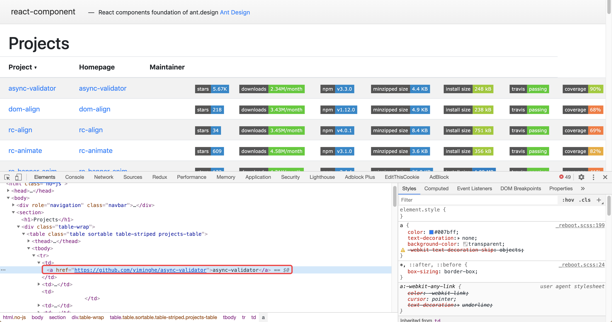

### 用 shell 脚本批量拉取更新 Antd 依赖库,[rc-component](https://github.com/react-component)仓库的项目

#### [项目地址](https://github.com/binyellow/batchClone)

#### [需求背景](#需求背景)

#### [实现思路](#实现思路)

#### [技术实现](#技术实现)

#### [demo 步骤](#demo步骤)

##### 需求背景

> 有时候看 api 无法实现的需求、想看下源码怎么写的，通常得一个一个去对应的 github 项目地址 clone，比较麻烦，也容易遗漏

##### 实现思路

可能方法有点蠢，稍微分析一下我去拉取的过程，不想看的话直接看技术实现 🐶

1. [查看 rc-component 的 github 地址](https://github.com/react-component)，仓库内有 94 个项目，切换分页时候并不是返回的 json 数据，而是 string，所以我点开了它的[homePage](http://react-component.github.io/badgeboard/)
   1. 
2. 这个页面就像我喜欢的样子，所有的项目信息都在了，我们要的无非就是 git 地址
   1. 因为在浏览器上用 JQ 遍历的信息打印再控制台不好操作
   2. 所以决定用 node+cherrio 去获取 dom 信息，然后读写到 txt 就好了
3. 我想爬到所有的 github 地址信息，然后用 shell 脚本去遍历然后 clone 和 update

##### 技术实现

1. 拿到 homePage 的页面，用[cheeio](https://www.npmjs.com/package/cheerio)解析成 dom，然后就可以想 jq 一样的操作 dom 了
   1. [有个 node 中文版主的快速入门的教程推荐下](https://github.com/alsotang/node-lessons/tree/master/lesson3)
2. 将拿到的所有项目地址写入 txt
3. shell 脚本遍历 txt，执行 clone，update

##### demo 步骤

1. `yarn`
2. `node index.js`: 生成 txt，详见代码
3. `bash clone.sh`: 批量 clone
4. `bash pull.sh`: 遍历当前文件夹下又.git 的项目，然后执行 git pull
